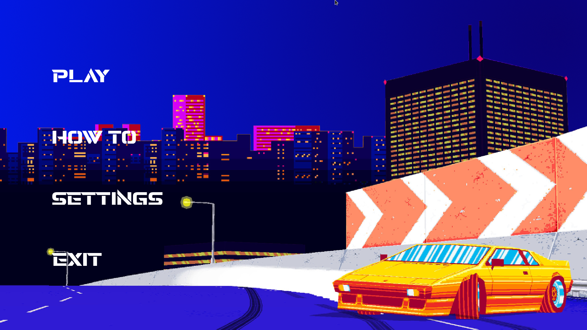

# MY RPG PROJECT
An Epitech project with the goal to make a rpg game.

# History

* Launch the game and click on "HOW TO" button

# Options

* You can change the volume in the option file. 0 for off and max on 100.
* Settings button in the game to modify volume with graphical interface.

# Inside ?

* A little history
* A quest to access to the boss
* NPCs that sell items

# Want to launch the game ?

* Clone this repository
* Execute the **make** command
* You can launch the game with **./my_rpg**
* Drop a star !
